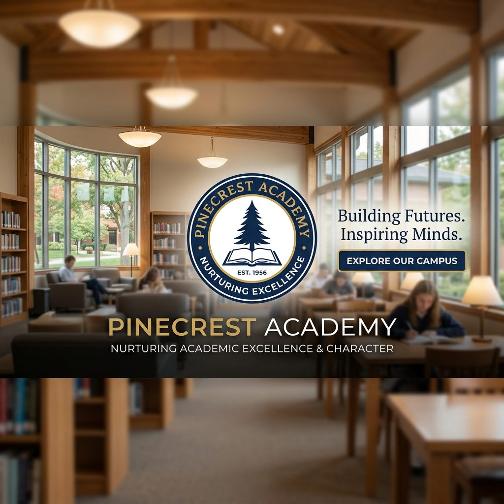

# Pinecrest Academy



Pinecrest Academy is a premium, fully responsive single-page landing website designed for modern educational institutions. It integrates notice boards, event galleries, contact forms, interactive maps, and scroll-triggered animations into a cohesive and aesthetic presentation.

## Live Project Links
- **GitHub Repository**: [https://github.com/StutiJain4999/Pinecrest-Academy](https://github.com/StutiJain4999/Pinecrest-Academy)
- **Live Deployed Website**: [https://chatbot-zeta-orpin.vercel.app](https://chatbot-zeta-orpin.vercel.app)

---

## Features

### 🌟 Modern Glassmorphic UI
Built using state-of-the-art web design aesthetics, featuring card layouts with translucent backdrops (`backdrop-filter`), vibrant HSL-curated colors, smooth shadows, and animated visual icons.

### 📱 Responsive Layout
Optimized for a seamless user experience across multiple breakpoints:
- **Desktop (1920px)** & **Laptop (1440px)**: Multi-column grid distribution.
- **Tablet (768px)**: Adaptive navigation menu with custom mobile hamburger slide-out toggles.
- **Mobile (480px)**: Compact padding, stacking columns, and touch-optimized buttons.

### 🔔 notice Board & Events
- **Notice Board**: Displays lists of academic alerts with custom blinking "NEW" tags and category icons.
- **Events Grid**: Interactive cards displaying sport/science events, date tags, and "Read More" hover-lift slide animations.

### 📬 Glassmorphic Contact Form & Map
- Integrated contact form with complete JavaScript input validation, custom error/success warnings, and floating labels.
- Styled responsive container embedding a live responsive Google Maps location iframe.

### 🎬 Scroll-Triggered Animations
Powered by the Animate On Scroll (AOS) library and custom keyframes, creating elegant entrance shifts, floating icons, and card hover glows.

---

## Technology Stack
- **HTML5**: Structured semantic markup with ARIA roles for accessibility.
- **CSS3 (Vanilla)**: Custom design system using CSS custom properties, grid, flexbox, and keyframes.
- **JavaScript**: Core browser script for animations, form check, and menu toggles.
- **AOS Library & FontAwesome**: CDN integrations for scroll animation styles and modern icons.

---

## Folder Structure

```
Pinecrest-Academy/
├── assets/
│   ├── images/
│   │   ├── hero.png            # Premium campus hero banner
│   │   ├── about.png           # Interactive about-us study image
│   │   └── og-image.png        # Open Graph card banner
│   └── icons/
│       └── favicon.ico         # Favicon icon
├── css/
│   └── style.css               # Clean modular layout stylesheets
├── js/
│   └── script.js               # Responsive triggers and forms script
├── .gitignore                  # Git exclude list
├── LICENSE                     # MIT License
├── package.json                # Project details
├── robots.txt                  # Search crawler configuration
├── sitemap.xml                 # XML sitemap configuration
├── README.md                   # Professional project presentation
└── index.html                  # Main entry point
```

---

## Installation & Running Locally

### Prerequisites
To test and run the project locally, make sure you have [Node.js](https://nodejs.org/) installed.

### Steps
1. Clone the repository:
   ```bash
   git clone https://github.com/StutiJain4999/Pinecrest-Academy.git
   ```
2. Navigate into the project folder:
   ```bash
   cd Pinecrest-Academy
   ```
3. Initialize a local server (using Vercel dev or standard http-server):
   ```bash
   # Run Vercel local dev environment
   npx vercel dev
   ```
4. Open your browser and go to `http://localhost:3000`.

---

## Deployment
This project is linked directly to GitHub and deployed on **Vercel**:
- Auto-builds and deploys upon pushing to the `main` branch.
- Configured using Vercel static asset routing.

---

## Future Scope / Improvements
- Add a dark-mode toggle switch utilizing CSS variables.
- Connect the contact form submission handler to a backend service or API (e.g. Formspree or EmailJS).
- Build a separate portal page for notice expansions.

---

## Author
- **Stuti Jain** - Developer & Designer
- **GitHub**: [@StutiJain4999](https://github.com/StutiJain4999)

---

## License
This project is licensed under the MIT License - see the [LICENSE](LICENSE) file for details.

## Acknowledgements
- Google Fonts (Poppins & Inter)
- FontAwesome Icons
- AOS (Animate on Scroll)
